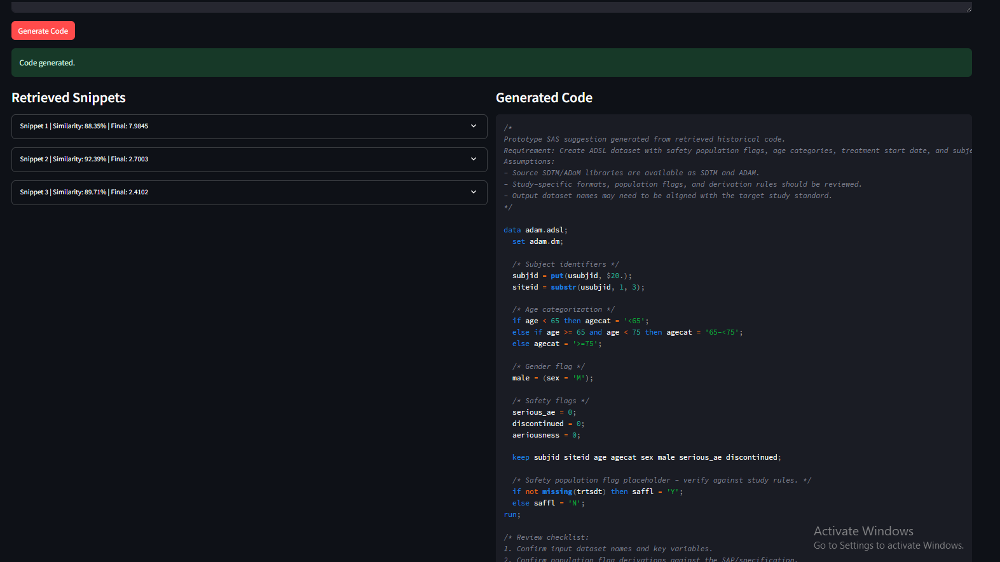
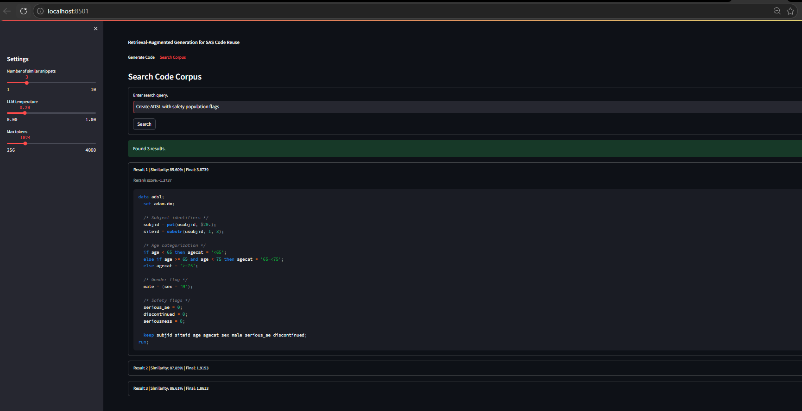

# RAG-Powered SAS Code Reuse Assistant for Clinical Trial Programming

A working prototype for clinical statistical programmers who need to reuse and adapt SAS code from prior studies.

This is a prototype decision-support tool, not an autonomous clinical programming system. Generated SAS code requires statistical programmer review before use.

The core problem is simple: programmers often rewrite ADSL, ADAE, ADLB, TLF, listing, and summary code even when very similar logic already exists. This assistant ingests synthetic historical SAS scripts, retrieves the most relevant snippets for a new AdAM or TLF requirement, reranks them, and generates a reusable SAS code suggestion.


Screenshots are included as demo evidence for the current working Streamlit UI.


### Search



### Code Generation




### Hybrid Retrieval

The search view retrieves SAS snippets from the synthetic corpus and ranks them with vector similarity, keyword matching, and reranking.

## Features

- SAS code ingestion from a local corpus
- SAS-aware chunking for DATA steps, PROC blocks, SQL, reports, and macros
- Embedding generation with sentence-transformers
- ChromaDB-backed vector search
- CLI commands for ingestion, search, statistics, and generation
- FastAPI endpoints for health checks, retrieval, and generation
- Streamlit interface for searching the corpus and generating SAS suggestions
- Configurable LLM providers for OpenAI, Claude, or a local CodeLlama model


## How It Works

```text
SAS corpus
  -> code chunks
  -> embeddings
  -> ChromaDB vector store
  -> semantic retrieval
  -> retrieved SAS snippets
  -> LLM prompt
  -> SAS code suggestion
```

## Project Structure

```text
sas-rag-assistant/
  data/
    corpus/raw/        # Sample SAS programs
    vector_db/         # Generated ChromaDB data
  docs/                # Architecture, API, and deployment notes
  examples/            # Example requirements and expected output
  src/
    api/               # FastAPI application
    cli/               # Command-line interface
    core/              # Configuration and logging
    data/              # Corpus loading and chunking
    embeddings/        # Embedding model and vector store
    llm/               # LLM providers and code generation
    rag/               # Retrieval and prompt formatting
    web/               # Streamlit UI
  tests/
  config.yaml
  requirements.txt
```

## Setup

This project requires Python 3.10 or newer.

```powershell
cd sas-rag-assistant

python -m venv .venv
.\.venv\Scripts\activate
python -m pip install --upgrade pip
python -m pip install -r requirements.txt
```

On macOS or Linux, activate the environment with:

```bash
source .venv/bin/activate
```

## Configuration

Application settings live in [config.yaml](config.yaml). By default, the project reads SAS files from:

```text
data/corpus/raw
```

Before using generation, configure one of the supported LLM providers in `config.yaml`:

- `openai`
- `claude`
- `codellama`

For API-based providers, set the required environment variable in your shell or a local `.env` file:

```powershell
$env:OPENAI_API_KEY="your-api-key"
$env:ANTHROPIC_API_KEY="your-api-key"
```

For local CodeLlama usage, update the configured model path:

```yaml
llm:
  provider: codellama
  codellama:
    model_path: ./models/codellama-34b-instruct
```

## CLI Usage

Ingest the SAS corpus:

```powershell
python -m src.cli.cli ingest
```

Check the vector database:

```powershell
python -m src.cli.cli stats
```

Search for reusable SAS snippets:

```powershell
python -m src.cli.cli search --query "Create ADSL dataset with safety population flags" --top-k 3
```

Generate a SAS suggestion:

```powershell
python -m src.cli.cli generate --requirement "Create ADSL dataset with safety population flags" --top-k 3
```

You can also pass a custom corpus path:

```powershell
python -m src.cli.cli ingest --corpus-path "path\to\sas\programs"
```

## Streamlit UI

Start the web interface:

```powershell
streamlit run src/web/streamlit_app.py
```

## API Usage

Start the FastAPI application:

```powershell
python -m uvicorn src.api.app:app --reload
```

Health check:

```powershell
Invoke-RestMethod http://127.0.0.1:8000/health
```

Retrieve snippets:

```powershell
Invoke-RestMethod -Method Post "http://127.0.0.1:8000/api/retrieve?query=Create%20ADSL%20with%20safety%20flags&top_k=3"
```

Generate SAS code:

```powershell
$body = @{
  requirement = "Create ADSL dataset with safety population flags"
  top_k = 3
} | ConvertTo-Json

Invoke-RestMethod -Method Post "http://127.0.0.1:8000/api/generate" -ContentType "application/json" -Body $body
```

Interactive API documentation is available after startup:

- `http://127.0.0.1:8000/docs`
- `http://127.0.0.1:8000/redoc`

## Testing

```powershell
python -m pip check
python -m pytest tests -v
```

## Roadmap

- Add corpus metadata filters for study, therapeutic area, domain, and output type
- Add optional reranking after vector retrieval
- Add SAS syntax validation and linting
- Add audit trails for generated suggestions
- Add authentication and authorization for deployed use
- Add a human review workflow before code reuse
- Evaluate approved local code models for regulated environments

## Documentation

- [Architecture](docs/ARCHITECTURE.md)
- [API Reference](docs/API_DOCS.md)
- [Deployment Guide](docs/DEPLOYMENT.md)
- [Data Preparation](docs/DATA_PREP.md)
